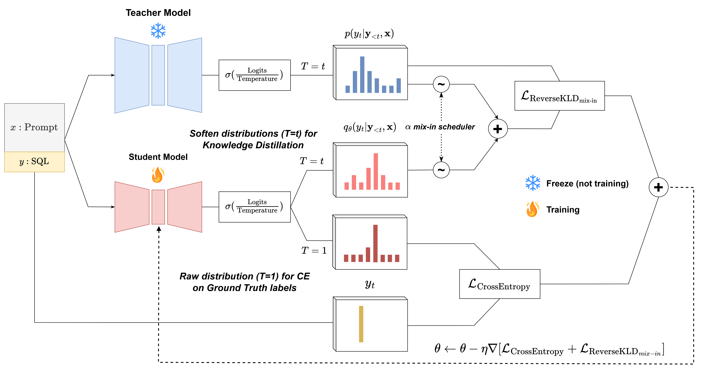

# Knowledge Distillation with Dynamic α Scheduler

**Distilling Large Language Models for SQL Generation**

This repository contains the implementation of the paper:

**_"Distilling Large Language Models for Structured Query Language Generation with Reverse Kullback–Leibler and Dynamic α Scheduler"_**

## Overview

This project explores a novel **Knowledge Distillation** approach tailored for **SQL generation** from natural language, addressing the high computational cost and limited deployability of large language models (LLMs) like GPT-4.

We propose a training pipeline that combines:

- **Reverse Kullback–Leibler Divergence (KLD)**
- A **Dynamic α Scheduler** inspired by learning rate scheduling

These techniques guide the student model more effectively during distillation, making it both smaller and more capable.

## Key Contributions

- **Reverse KLD Loss**: Enables the student to learn from the teacher without overfitting to its predictions, supporting more diverse and generalizable outputs.
- **Dynamic α Scheduler**: Adjusts the influence of the teacher dynamically throughout training to improve stability and prevent over-reliance.
- **Model Efficiency**: Our distilled model is **100x smaller than GPT-4**, yet outperforms it on SQL generation tasks.
- **Benchmark Performance**:
  - **80.5% execution accuracy** on standard datasets
  - **+10.2% improvement** on extra-hard SQL queries compared to its undistilled version

## Acknowledgments

This work builds on top of CodeS and StarCoder. We thank the authors for making their code and models publicly available.

## Contact

For questions, feel free to reach out via [GitHub Issues](https://github.com/nthng-quan/distill_t2sql/issues).
